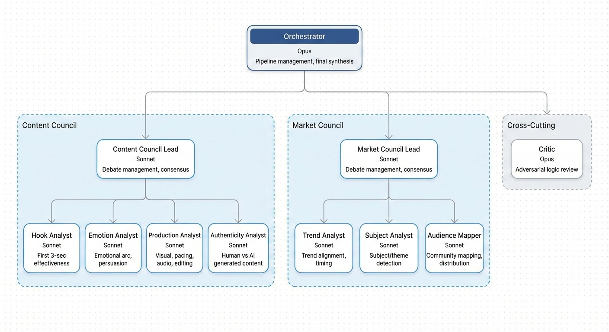

# Themis: AI Judge Council

Themis is a multi-agent AI evaluation system built as a Claude Code plugin. It takes a short-form video or blog post and produces three things: a prediction of whether the content is AI-generated or human-written, a virality score estimating how well it would perform socially, and a distribution analysis identifying which audiences and communities it would resonate with. Each output includes a concise rationale explaining why the system reached that conclusion.

Under the hood, 7 specialist AI judges organized into Content and Market councils debate across multiple rounds, face adversarial review from a Critic, and are synthesized by an Orchestrator — producing higher-quality evaluations than single-pass analysis.



## Setup

**Requirements:** Python 3.10+, FFmpeg, OpenAI Whisper, Claude Code v2.0+

```bash
# Install dependencies
brew install ffmpeg              # macOS (or: sudo apt install ffmpeg)
pip install openai-whisper

# Clone and verify
git clone git@github.com:SacredWizard/themis.git
cd themis
python3 scripts/check_dependencies.py
```

**Note:** For text-only evaluation, FFmpeg and Whisper are not required.

## Usage

Run inside Claude Code with Themis loaded (`claude --plugin-dir /path/to/themis`):

```bash
# Evaluate a video
/themis-evaluate path/to/video.mp4

# Evaluate a blog post
/themis-evaluate path/to/article.txt

# Fast mode (cheaper, single debate round)
/themis-evaluate path/to/video.mp4 --fast
```

### Standalone scripts (no Claude Code needed)

```bash
# Preprocess video → structured payload
python3 scripts/preprocess_video.py video.mp4 -o payload.json

# Preprocess text → structured payload
python3 scripts/preprocess_text.py article.txt -o payload.json

# Run AI detection on any text
python3 scripts/text_forensics.py --text-file article.txt

# Estimate pipeline cost
python3 scripts/token_tracker.py --compare
```

## Output

Themis produces structured JSON with three main sections:

| Section | What It Contains | Example |
|---------|-----------------|---------|
| **Virality** | Score (0-100), tier, 5 component breakdowns, rationale | `"score": 72, "tier": "strong", "rationale": "Strong hook and trend alignment, held back by moderate shareability"` |
| **Authenticity** | Verdict, AI probability, statistical metrics, rationale | `"verdict": "likely_human", "ai_probability": 0.15, "rationale": "High sentence-length variance and distinctive voice"` |
| **Distribution** | Target audiences, platform fit scores, strategy, rationale | `"community": "Dev Twitter", "relevance_score": 85, "rationale": "Technical subject matter with tutorial format"` |

Plus: executive summary, strengths/weaknesses, improvement suggestions, council disagreements, and token/cost metadata.

## Assumptions

- **Text forensics uses heuristics, not ML.** AI detection relies on statistical metrics (burstiness, type-token ratio, hedging frequency, readability variance, etc.) combined with Claude's qualitative assessment. No PyTorch or HuggingFace — pure Python standard library only. This trades some detection accuracy for zero-dependency simplicity.
- **Judges cannot hear audio.** Video judges infer music/audio context from transcript text and keyframe visuals. Actual audio signal analysis (song identification, trending sound detection) is deferred to a future phase.
- **Authenticity is separate from virality.** The AI detection score does not factor into the virality calculation. They are independent assessments — content can score high on virality while being flagged as AI-generated.
- **Short texts are unreliable.** Texts under 50 words get an `insufficient_text` flag with null metrics. The forensics are most reliable above 500 words.
- **Input is local files only.** Themis currently accepts local video and text files. It does not accept URLs — fetching content from links (YouTube, blog URLs, social media posts) is not yet supported.
- **Short-form video and text only.** The evaluation framework is tuned for short-form video ads (TikTok, Reels, Shorts) and blog-length text content. Long-form video, podcasts, or other formats are not currently supported.
- **Cost estimates are approximations.** Token counts and costs are estimated based on typical content; actual costs vary with content length and image count.

## Future Improvements

- **Audio fingerprinting (Phase 4):** Integrate an API (AudD, ACRCloud, or Shazam) to identify background music and cross-reference with Spotify/TikTok trending data. This would add a real `music_virality` signal instead of inferring audio from transcript cues.
- **Video/audio forensics for AI detection:** Detect TTS (text-to-speech) patterns, synthetic voice artifacts, and AI-generated video tells. Currently authenticity analysis is text-only.
- **Evaluation history and benchmarking:** Store past evaluations in a local database to enable trend analysis, comparative scoring, and calibration against real-world virality outcomes.
- **A/B comparison mode:** Evaluate two pieces of content side-by-side with relative ranking and differential analysis.
- **URL input support:** Accept links (YouTube, blog URLs, social media posts) and automatically fetch/extract the content for evaluation, while accounting for prompt injection attacks .
- **Multi-modal authenticity checks:** Extend AI detection beyond text to include visual artifact detection (AI-generated images/video), synthetic voice detection, and metadata forensics.

## Detailed Documentation

- **[Detailed README](DETAILED-README.md)** — Full installation options, testing guide, utility script reference, project structure
- **[Architecture & Design](design/ARCHITECTURE.md)** — Mermaid diagrams, design decisions, pipeline details, phase history

## License

Apache License 2.0 with Non-Commercial Restriction. See [LICENSE](LICENSE) for details.

Free for personal, educational, and research use. Commercial use requires prior written permission.
