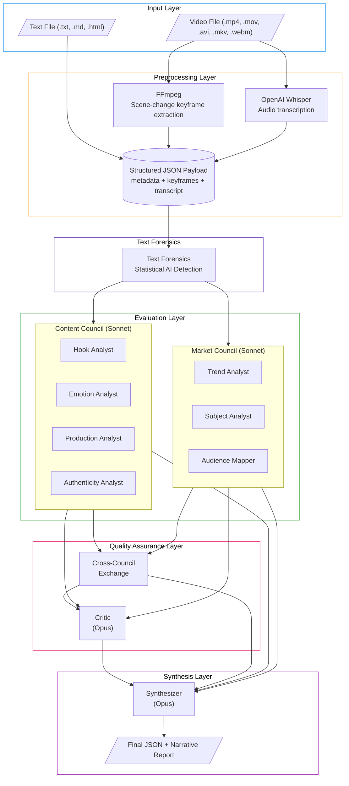
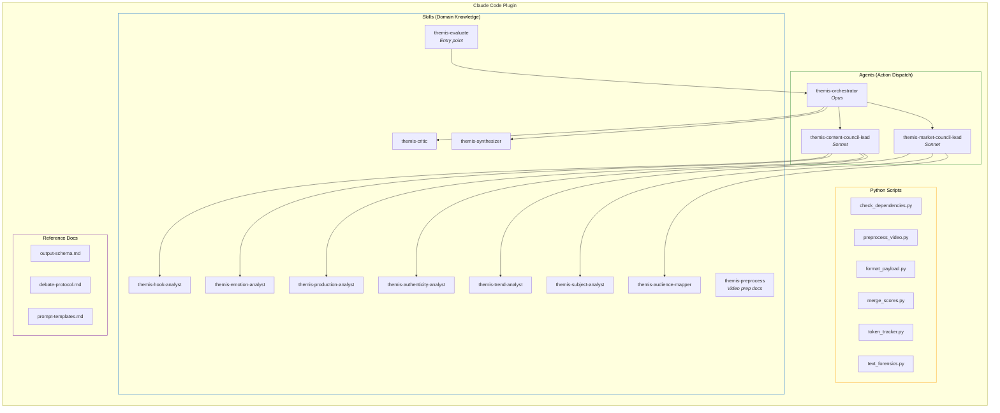
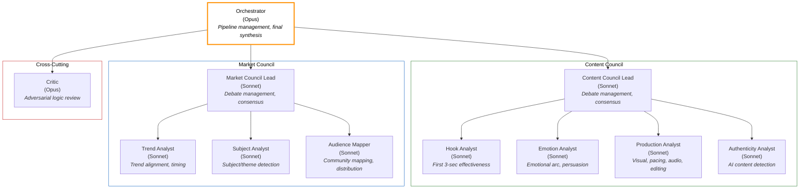
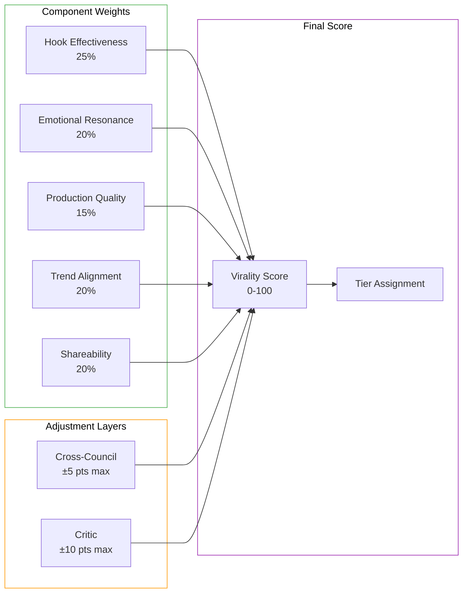
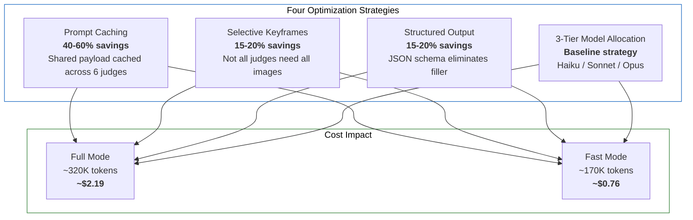
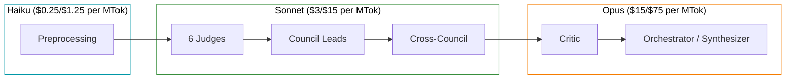
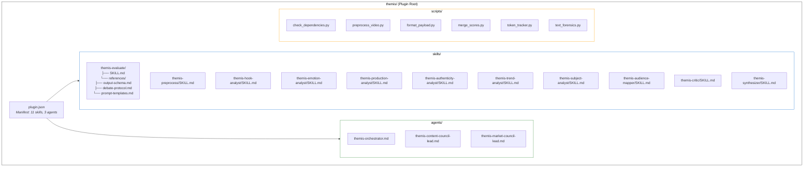
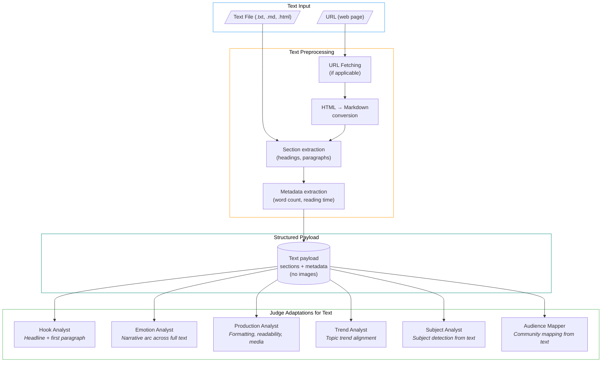
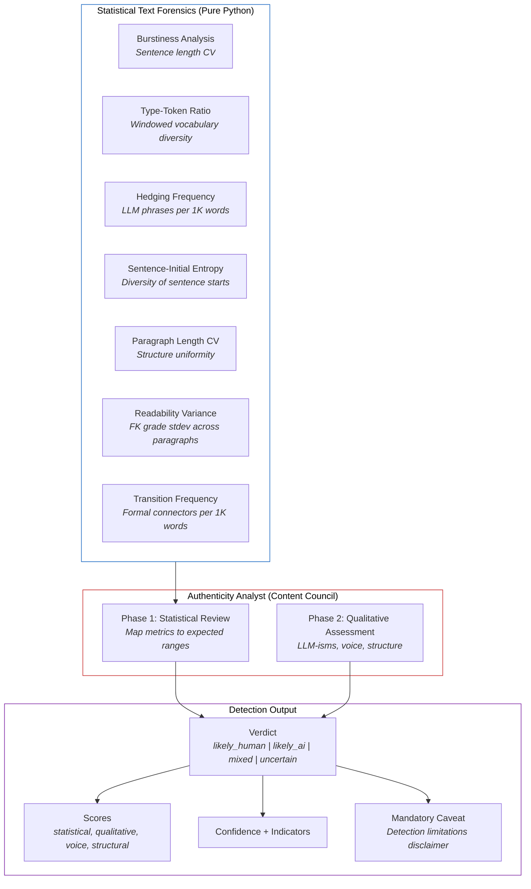
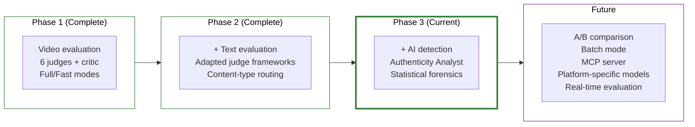

# Themis: Architecture & Design Document

> **Version:** 1.1.0 | **Last Updated:** 2026-02-20 | **Status:** Phase 3 Complete (AI Detection)

## TLDR

Themis is a multi-agent AI system built as a **Claude Code plugin** that evaluates short-form video ads for virality potential. Six specialist AI judges organized into two councils (Content + Market) debate independently, revise after seeing peers, exchange findings cross-council, then face adversarial review from a Critic before an Orchestrator synthesizes the final structured output.

**Why this architecture?** Single-pass LLM evaluation produces shallow, overconfident assessments. Multi-agent debate forces judges to defend reasoning, surfaces blind spots, and preserves genuine disagreements rather than averaging them away. The result is higher-quality, more nuanced evaluations with transparent reasoning chains.

**Key numbers:**
- 7 specialist judges + 1 critic + 1 orchestrator = 9 AI agents per evaluation
- 2 debate rounds + cross-council exchange + critic review = 4 layers of quality assurance
- Full mode: ~350K tokens, ~$2.50 | Fast mode: ~185K tokens, ~$0.85
- Prompt caching saves ~40-60% on shared payload tokens

---

## Table of Contents

1. [System Architecture](#1-system-architecture)
2. [Agent Hierarchy](#2-agent-hierarchy)
3. [Evaluation Pipeline](#3-evaluation-pipeline)
4. [Debate Protocol](#4-debate-protocol)
5. [Score Aggregation](#5-score-aggregation)
6. [Token Optimization](#6-token-optimization)
7. [Plugin Architecture](#7-plugin-architecture)
8. [Design Decisions](#8-design-decisions)
9. [Phase 2: Text Evaluation](#9-phase-2-text-evaluation)
10. [Phase 3: AI Detection](#10-phase-3-ai-detection)
11. [Future Improvements](#11-future-improvements)

---

## 1. System Architecture

### High-Level Pipeline



### Component Map



---

## 2. Agent Hierarchy

### Council Structure



### Agent Roles & Responsibilities

| Agent | Model | Council | Primary Dimension | Keyframes Received |
|-------|-------|---------|-------------------|--------------------|
| Hook Analyst | Sonnet | Content | `hook_effectiveness` | First 3-4 only |
| Emotion Analyst | Sonnet | Content | `emotional_resonance` | All |
| Production Analyst | Sonnet | Content | `production_quality` | All |
| Authenticity Analyst | Sonnet | Content | `authenticity` (separate) | None |
| Trend Analyst | Sonnet | Market | `trend_alignment` | Sampled ~6 |
| Subject Analyst | Sonnet | Market | *(feeds Audience Mapper)* | All |
| Audience Mapper | Sonnet | Market | `shareability` | Sampled ~6 |
| Critic | Opus | Cross-cutting | Confidence adjustment | None |
| Orchestrator | Opus | Cross-cutting | Final synthesis | None |

---

## 3. Evaluation Pipeline

### Full Mode Pipeline (Detailed)


### Fast Mode Pipeline


### Mode Comparison

| Aspect | Full Mode | Fast Mode |
|--------|-----------|-----------|
| Debate rounds | 2 (independent + informed) | 1 (independent only) |
| Cross-council exchange | Yes | Skipped |
| Critic model | Opus | Sonnet |
| Synthesis model | Opus | Sonnet |
| Judge model | Sonnet | Sonnet |
| Estimated tokens | ~255K-350K | ~145K-185K |
| Estimated cost | $1.40-2.60 | $0.70-1.00 |
| Quality | Highest (multi-layer QA) | Good (single-pass + critic) |

---

## 4. Debate Protocol

### Round Flow


### Consensus Mechanism

**Confidence-weighted averaging:**

```
final_score = sum(score_i × confidence_i) / sum(confidence_i)
```

**Disagreement preservation rules:**

| Spread | Action |
|--------|--------|
| ≤10 points | High-confidence consensus — averaged normally |
| 11-20 points | Normal averaging with noted spread |
| 21-30 points | Preserved as `council_disagreement` with both positions |
| >30 points | Flagged for Critic review with high severity |

**Anti-patterns the protocol is designed to prevent:**
- **Groupthink**: Round 2 should not converge all scores to the mean
- **Anchoring**: Judges evaluate reasoning, not just adjust toward first numbers seen
- **Politeness convergence**: Softening real disagreements is prevented by preservation rules
- **Score inflation**: Calibration guide enforces use of the full 0-100 range

---

## 5. Score Aggregation

### Virality Score Computation



### Tier Thresholds

| Score Range | Tier | Interpretation |
|-------------|------|----------------|
| 81-100 | Exceptional | Top-tier viral potential |
| 61-80 | Strong | Likely to perform well |
| 41-60 | Promising | Has viral elements, needs refinement |
| 21-40 | Moderate | Below average, significant improvements needed |
| 0-20 | Low | Unlikely to gain traction |

### Confidence Calculation

```
base_confidence = min(all_judge_confidences)
final_confidence = base_confidence + critic_adjustment
```

Where `critic_adjustment` ranges from -0.20 (evidence of major flaws) to +0.10 (evaluation is unusually robust).

---

## 6. Token Optimization

### Strategy Overview



### Prompt Caching

The payload (metadata + transcript) is shared across all 6 judges. By placing shared content at the prompt prefix, Claude's prompt caching caches prefix matches:

| Stage | Cache Hit Rate | Savings Mechanism |
|-------|---------------|-------------------|
| Round 1 (5 of 6 judges) | ~83% | First judge populates cache; others hit it |
| Round 2 (5 of 6 judges) | ~75% | R1 outputs + payload partially cached |
| Cross-council | ~50% | Smaller payloads, less overlap |

**Cached tokens cost 90% less** than uncached input tokens ($0.30/MTok vs $3.00/MTok for Sonnet).

### Selective Keyframe Distribution

| Judge | Keyframes | Strategy | Rationale |
|-------|-----------|----------|-----------|
| Hook Analyst | First 3-4 | `first_n` | Only evaluates opening seconds |
| Emotion Analyst | All | `all` | Needs full emotional arc |
| Production Analyst | All | `all` | Needs full visual sequence |
| Trend Analyst | ~6 sampled | `sampled` | Needs format sense, not every frame |
| Subject Analyst | All | `all` | Complete subject detection |
| Audience Mapper | ~6 sampled | `sampled` | Visual signals, not every frame |
| Authenticity Analyst | None | `none` | Text/transcript + forensics only |
| Critic | None | `none` | Evaluates reasoning, not content |
| Orchestrator | None | `none` | Synthesizes judge outputs |

Image tokens estimated at ~1,600 per keyframe. With 15 keyframes, selective distribution saves ~30-40% of image tokens across the pipeline.

### Model Allocation



---

## 7. Plugin Architecture

### Claude Code Plugin Structure



### Installation Methods

1. **Plugin Directory** (Development): `claude --plugin-dir /path/to/themis`
2. **Install Script** (Regular Use): `./install.sh project|user` — symlinks skills + agents into `.claude/`
3. **Manual**: Symlink skills and agents into `.claude/skills/` and `.claude/agents/`

### Skills vs Agents Design Pattern

| Aspect | Skills | Agents |
|--------|--------|--------|
| Purpose | Domain knowledge + evaluation framework | Action dispatch + coordination |
| Contains | Scoring rubrics, sub-scores, anti-patterns, examples | Pipeline steps, tool access, flow control |
| Example | Hook Analyst SKILL.md: 7 hook types, scoring criteria | Orchestrator: manages full pipeline sequence |
| Used via | `Skill` tool (loads knowledge into context) | `Task` tool (spawns as subagent) |
| Count | 10 skills | 3 agents |

---

## 8. Design Decisions

### Decision 1: Multi-Agent Debate vs Single-Pass Evaluation

**Choice:** Hierarchical sub-council debate architecture with 6 judges.

**Alternatives considered:**
- **Single-pass evaluation**: One prompt evaluates everything. Cheaper (~$0.10-0.20) but produces shallow, overconfident assessments with no internal consistency checks.
- **Panel of 3 generalist judges**: Simpler architecture but loses specialist depth. A generalist cannot match a dedicated Hook Analyst's knowledge of opening mechanics.
- **Single council of 6 judges**: No council structure. Cross-council exchange becomes impossible; loses the content-vs-market tension that surfaces real insights.

**Why we chose this:** The debate pattern demonstrably improves evaluation quality. Round 2 forces judges to engage with contrary evidence. Cross-council exchange catches content-market misalignments. The Critic adds adversarial pressure that prevents comfortable consensus. The cost (~$2/evaluation) is justified for content that may have thousands of dollars of production and distribution budget behind it.

### Decision 2: Skills for Domain Knowledge, Agents for Coordination

**Choice:** Judges are implemented as Skills (SKILL.md), coordinators as Agents (.md in agents/).

**Alternatives considered:**
- **All agents**: Each judge is an agent with full tool access. Simpler conceptually but agents carry less domain knowledge — they're action-oriented, not knowledge-oriented.
- **All skills**: Including orchestration as a skill. Loses the ability to specify tool access, model tier, and delegation capabilities that agents provide.

**Why we chose this:** Skills are the right abstraction for domain expertise (scoring frameworks, evaluation criteria, anti-patterns). Agents are the right abstraction for coordination (dispatch judges, manage debate rounds, invoke tools). The separation is clean: skills say *what to evaluate*, agents say *how to orchestrate*.

### Decision 3: Scene-Change Keyframe Extraction over Uniform Sampling

**Choice:** FFmpeg `select='gt(scene,threshold)'` with threshold 0.3, fallback to uniform sampling.

**Alternatives considered:**
- **Uniform sampling**: Extract a frame every N seconds. Misses rapid cuts in short-form ads where shots last 1-2 seconds.
- **Every-frame extraction**: Massive token cost. A 30-second video at 30fps = 900 frames.
- **ML-based scene detection**: More accurate but adds a heavy dependency (PySceneDetect, etc.).

**Why we chose this:** Short-form ads have rapid, intentional cuts. Scene-change detection captures each distinct shot. The threshold of 0.3 with min 5 / max 20 keyframes balances coverage against token cost. Uniform fallback ensures minimum coverage if the scene detector finds too few transitions.

### Decision 4: Selective Keyframe Distribution per Judge

**Choice:** Each judge receives a different keyframe subset based on their role.

**Alternatives considered:**
- **All judges get all keyframes**: Simpler but wasteful. Hook Analyst only needs the first 3-4 frames; Critic needs none.
- **No keyframes for any judge**: Text-only evaluation misses visual quality, production techniques, and hook visual impact.

**Why we chose this:** Image tokens are expensive (~1,600 tokens per keyframe). With 15-20 keyframes, sending all to all judges costs ~150K-192K image tokens. Selective distribution reduces this by ~30-40% while giving each judge exactly the visual context they need.

### Decision 5: Confidence-Weighted Averaging with Disagreement Preservation

**Choice:** Weighted average where each judge's score is weighted by their stated confidence, with mandatory preservation of >20-point disagreements.

**Alternatives considered:**
- **Simple average**: Equal weight regardless of confidence. A judge at 0.4 confidence shouldn't have the same weight as one at 0.9.
- **Median**: Robust to outliers but loses information about the distribution.
- **Majority vote on tier**: Loses score granularity.

**Why we chose this:** Confidence-weighted averaging rewards judges who have clear evidence for their assessment. Disagreement preservation (never averaging away >20-point spreads) ensures that genuine uncertainty is surfaced rather than hidden behind a false-precision average. This is more honest and more useful to the end user.

### Decision 6: No MCP Server for Phase 1

**Choice:** Python scripts invoked via Bash tool, no Model Context Protocol server.

**Alternatives considered:**
- **MCP server**: Expose preprocessing and payload formatting as MCP tools. Provides cleaner tool integration but adds deployment complexity (process management, error handling, connection lifecycle).
- **Native Claude Code tools only**: No Python scripts at all. FFmpeg and Whisper would need to be invoked directly. More complex, less maintainable.

**Why we chose this:** MCP adds complexity without clear benefit when the preprocessing is a simple ETL pipeline (video → keyframes + transcript → JSON). Python scripts via Bash are debuggable, testable, and portable. MCP may be reconsidered if we need persistent state, streaming, or more complex tool interactions.

### Decision 7: 3-Tier Model Allocation (Haiku/Sonnet/Opus)

**Choice:** Haiku for preprocessing, Sonnet for judges, Opus for critic + synthesis.

**Alternatives considered:**
- **All Opus**: Best quality but ~10x more expensive. Judges don't need Opus-tier reasoning for structured evaluation.
- **All Sonnet**: Cheaper but loses the Critic's and Orchestrator's ability to synthesize complex multi-source inputs with the nuance that Opus provides.
- **All Haiku**: Too shallow for meaningful evaluation.

**Why we chose this:** Matches model capability to task complexity. Judges perform structured evaluation with clear scoring rubrics — Sonnet handles this well. The Critic needs to find logical flaws across 6 judges' outputs — this requires deeper reasoning. The Synthesizer needs to merge complex multi-source data into coherent narrative — Opus excels here.

### Decision 8: Prompt Caching Strategy (Prefix-Based)

**Choice:** Place shared payload (metadata + transcript) at the start of every judge prompt, before judge-specific instructions.

**Why:** Claude's prompt caching works on prefix matches. If all 6 judges start with the same payload bytes, the second through sixth judge calls hit the cache at ~90% discount. This saves 40-60% on the most expensive token category (input tokens for image-heavy payloads).

### Decision 9: Fast Mode as First-Class Configuration

**Choice:** Built-in `--fast` flag that skips Round 2, cross-council exchange, and downgrades Critic/Synthesis to Sonnet.

**Why:** Not every evaluation justifies $2+ and 5 minutes of processing. Fast mode provides a ~65% cost reduction while still running all 6 judges and the Critic. It's the right default for initial screening before investing in a full evaluation.

### Decision 10: Apache 2.0 with Non-Commercial Clause

**Choice:** Apache License 2.0 with an additional restriction prohibiting commercial use without written permission.

**Why:** Allows open development, educational use, and personal experimentation while retaining commercial control. The Apache 2.0 base provides patent protection and clear contribution terms.

---

## 9. Phase 2: Text Evaluation

### Overview

Extend Themis to evaluate blog-length text content using the same judge council architecture.



### Key Adaptations

| Judge | Video Mode | Text Mode |
|-------|-----------|-----------|
| Hook Analyst | First 3-4 keyframes, opening audio | Headline + first paragraph analysis |
| Emotion Analyst | Visual + audio emotional arc | Narrative arc, language tone, structure |
| Production Analyst | Visual quality, pacing, editing | Formatting, readability, media embeds |
| Trend Analyst | Visual trend signals, format | Topic/keyword trend alignment |
| Subject Analyst | Visual + audio subject detection | Text content classification |
| Audience Mapper | Visual community signals | Text-based community mapping |

### Token Optimization for Text

Text evaluations are significantly cheaper than video:
- No image tokens (largest cost savings)
- Better prompt caching (text payload is more compressible)
- Shorter payloads overall (a 1000-word blog vs 15 keyframes + transcript)
- Estimated cost: ~$0.30-0.60 full mode, ~$0.15-0.30 fast mode

---

## 10. Phase 3: AI Detection (Complete)

### Overview

The Authenticity Analyst judge detects AI-generated content using a hybrid approach: pure-Python statistical text forensics (`scripts/text_forensics.py`) combined with Claude's qualitative writing pattern assessment via the Authenticity Analyst judge skill.

**Key design decisions:**
- Authenticity is a **separate score** from virality (not a weighted component) — backward compatible
- Authenticity Analyst joins the **Content Council** as 4th judge — participates in debate rounds
- Forensics scope is **text-only** — video/audio forensics deferred to future phases
- No heavy ML dependencies — pure Python standard library only



### Statistical Indicators

| Metric | Human Content | AI Content | Weight |
|--------|--------------|------------|--------|
| Burstiness (CV) | 0.5-1.0+ | 0.15-0.35 | 15% |
| Type-Token Ratio | 0.4-0.65 | 0.6-0.8+ | 10% |
| Hedging frequency (per 1K) | 0-3 | 5-15+ | 20% |
| Sentence-initial entropy | 0.7-0.95 | 0.4-0.65 | 15% |
| Paragraph length CV | 0.4-0.8+ | 0.1-0.3 | 10% |
| Readability variance (FK stdev) | 2.0-5.0+ | 0.5-1.5 | 15% |
| Transition frequency (per 1K) | 2-8 | 10-20+ | 15% |

### Output Schema Extension

The `authenticity` section is a **peer of `virality`** in the output schema (not nested within it):

```json
{
  "authenticity": {
    "verdict": "likely_human | likely_ai | mixed | uncertain",
    "confidence": 0.0,
    "ai_probability": 0.0,
    "indicators": [
      {
        "type": "statistical | qualitative | structural | voice",
        "signal": "description of what was detected",
        "direction": "human | ai",
        "weight": "low | medium | high"
      }
    ],
    "statistical_metrics": {
      "burstiness_score": "float",
      "type_token_ratio": "float",
      "hedging_frequency_per_1k": "float",
      "sentence_initial_entropy": "float",
      "paragraph_length_cv": "float",
      "readability_variance": "float",
      "transition_frequency_per_1k": "float",
      "composite_statistical_probability": "float"
    },
    "caveat": "AI detection is inherently uncertain..."
  }
}
```

---

## 11. Future Improvements

### Short-Term (Post-Phase 3)

1. **Background music / audio analysis (Phase 4)**: Integrate audio fingerprinting (AudD, ACRCloud, or Shazam API) to identify songs in video content, then cross-reference with Spotify/TikTok trending data to score music virality. Currently, judges reference music conceptually from transcript cues and keyframe context but cannot actually hear the audio. This would add a `music_virality` signal to the Trend Analyst and Production Analyst. Requires an external API key and per-evaluation cost. Video/audio forensics for AI detection (TTS patterns, synthetic voice detection) could also be bundled into this phase.

2. **Persistent evaluation history**: Store past evaluations in a local database to enable trend analysis and comparative scoring across videos.

3. **A/B comparison mode**: Evaluate two videos side-by-side with relative ranking and differential analysis.

4. **Custom scoring weights**: Allow users to override the default component weights (e.g., prioritize hook effectiveness at 40% for TikTok-first content).

5. **Webhook/notification integration**: Send evaluation results to Slack, email, or other destinations upon completion.

### Medium-Term

5. **MCP server migration**: Replace Python script Bash calls with an MCP server for cleaner tool integration, persistent state, and streaming progress updates.

6. **Batch evaluation mode**: Evaluate a folder of videos and produce a ranked report with cross-comparison.

7. **Fine-tuned scoring calibration**: Collect human-verified virality outcomes and calibrate scoring thresholds against real-world performance data.

8. **Multi-language support**: Extend Whisper transcription to explicitly support non-English content with language-aware evaluation criteria.

### Long-Term

9. **Real-time evaluation**: Stream video frames as they're recorded and produce live scoring feedback during production.

10. **Platform-specific models**: Train or prompt judges with platform-specific knowledge (TikTok algorithm signals, Instagram Reels ranking factors, YouTube Shorts discovery mechanics).

11. **Creator fingerprinting**: Identify the creator's style signature and evaluate content consistency with their brand.

12. **Competitive analysis**: Compare content against trending videos in the same niche to identify differentiation opportunities.

### Architecture Evolution



---

## Appendix: File Reference

| File | Purpose |
|------|---------|
| `.claude-plugin/plugin.json` | Plugin manifest (11 skills, 3 agents) |
| `skills/themis-evaluate/SKILL.md` | Main entry point — 8-step pipeline definition |
| `skills/themis-evaluate/references/output-schema.md` | JSON output schema v1.0 |
| `skills/themis-evaluate/references/debate-protocol.md` | Debate rounds, consensus mechanism, anti-patterns |
| `skills/themis-evaluate/references/prompt-templates.md` | Shared prompt fragments for all judges |
| `skills/themis-hook-analyst/SKILL.md` | Hook effectiveness evaluation (7 hook types) |
| `skills/themis-emotion-analyst/SKILL.md` | Emotional arc and persuasion analysis |
| `skills/themis-production-analyst/SKILL.md` | Visual, pacing, audio, editing quality |
| `skills/themis-trend-analyst/SKILL.md` | Trend alignment and cultural moment detection |
| `skills/themis-subject-analyst/SKILL.md` | Subject/theme/object detection and classification |
| `skills/themis-audience-mapper/SKILL.md` | Community mapping and platform distribution |
| `skills/themis-authenticity-analyst/SKILL.md` | AI content detection (statistical + qualitative) |
| `skills/themis-critic/SKILL.md` | Adversarial review (6 challenge categories) |
| `skills/themis-synthesizer/SKILL.md` | Final synthesis and score computation |
| `skills/themis-preprocess/SKILL.md` | Video preprocessing documentation |
| `agents/themis-orchestrator.md` | Opus agent — full pipeline management |
| `agents/themis-content-council-lead.md` | Sonnet agent — Content Council debate management |
| `agents/themis-market-council-lead.md` | Sonnet agent — Market Council debate management |
| `scripts/check_dependencies.py` | Validates Python 3.10+, FFmpeg, ffprobe, Whisper |
| `scripts/preprocess_video.py` | FFmpeg keyframe extraction + Whisper transcription |
| `scripts/format_payload.py` | Judge-specific payload formatting + token estimation |
| `scripts/merge_scores.py` | Confidence-weighted score aggregation |
| `scripts/token_tracker.py` | Per-stage token tracking + cost estimation |
| `scripts/text_forensics.py` | Statistical text forensics for AI detection |
| `install.sh` | Symlink-based plugin installer (project/user scope) |
| `uninstall.sh` | Plugin uninstaller |
